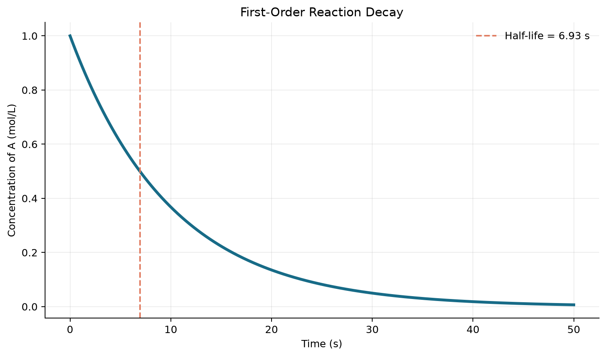
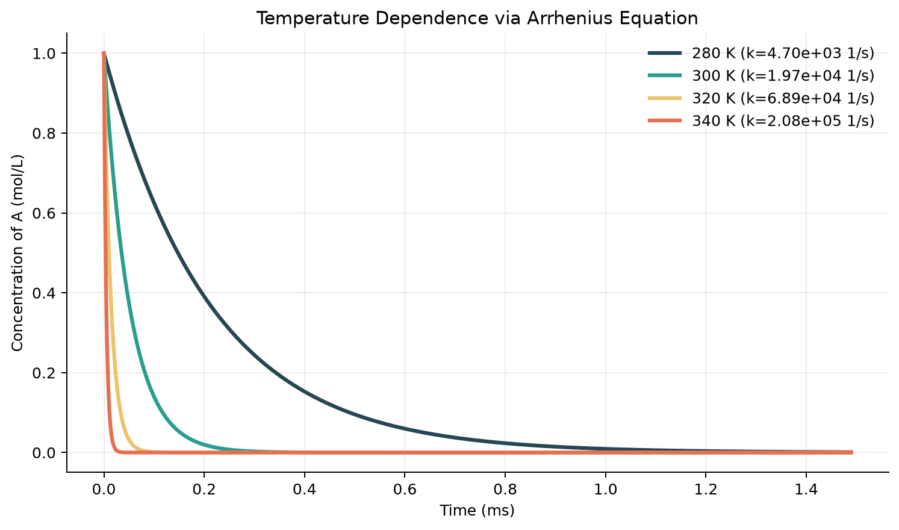
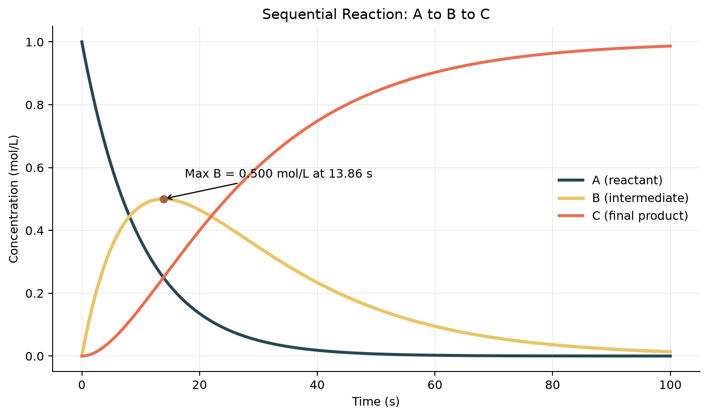

# Reaction Kinetics Simulations

Three chemical-engineering simulation projects implemented in Python.

## Project 1: First-Order Reaction Decay

Models the analytical concentration profile

`C(t) = C0 exp(-kt)`

for a batch reaction with `C0 = 1.0 mol/L` and `k = 0.1 s^-1`. The concentration falls exponentially, and the calculated half-life is **6.93 s**.



## Project 2: Arrhenius Temperature Dependence

Uses the Arrhenius equation to compare first-order reaction rates at 280 K, 300 K, 320 K, and 340 K. Increasing the temperature from 280 K to 340 K raises the rate constant by approximately **44.3x**.

The supplied kinetic constants imply sub-millisecond reactions, so the graph uses milliseconds to keep every curve visible.



## Project 3: Sequential Reaction A to B to C

Tracks reactant A, intermediate B, and final product C for consecutive first-order reactions. The intermediate reaches a maximum concentration of **0.500 mol/L at 13.86 s**, identifying the optimal stopping time when B is the desired product.



## Run the simulations

```bash
pip install -r requirements.txt
python projects_1_to_3_reaction_kinetics.py
```

Running the script regenerates all three PNG charts and their CSV datasets under `results/projects_1_to_3/`.
